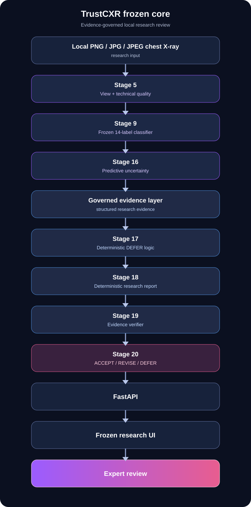

# TrustCXR

**Evidence-Governed Chest X-ray Research System**

[](requirements/lock-final-research-windows-cu130.txt) [](requirements/lock-final-research-windows-cu130.txt) [](requirements/lock-serving-stage21.txt) [](docs/release/RELEASE_NOTES_v1.0.0-research.md)

TrustCXR is a local, deterministic chest X-ray research pipeline with frozen vision models, predictive-uncertainty evidence, conservative downstream safety logic, and an expert-review interface.

> **RESEARCH USE ONLY · NOT A MEDICAL DIAGNOSIS · EXPERT REVIEW REQUIRED**

TrustCXR is not clinically or externally validated, is not medical-device software, and must not be used for diagnosis, treatment, autonomous release, or deployment decisions.

## Core workflow

```text
Local PNG/JPG/JPEG image
  → Stage 5 AP/PA/LATERAL view and non-clinical technical-quality proxy
  → Stage 9 frozen 14-label research classifier
  → Stage 16 predictive uncertainty where governed
  → limited structured evidence and Stage 17 DEFER-only safety logic
  → Stage 18 deterministic report draft
  → Stage 19 deterministic verifier
  → Stage 20 DEFER / deterministic revise / research-draft acceptance support
  → local FastAPI service
  → FROZEN_CORE_RESEARCH_REVIEW_UI
  → expert review
```

The real local-image workflow uses frozen Stage 5 and Stage 9 checkpoints. Model scores are research signals, not calibrated clinical probabilities or diagnoses. The UI makes no external requests and uses no browser persistence.

## Accepted research scope

### Image quality and view assessment

- AP, PA, and LATERAL model-identified view output.
- A research technical-quality proxy.

### Chest X-ray classification
- Frozen 14-label Stage 9 research model scores.

Classifier values are model signals only. They are not calibrated clinical probabilities and are not diagnoses.

Frozen labels: Atelectasis, Cardiomegaly, Effusion, Infiltration, Mass, Nodule, Pneumonia, Pneumothorax, Consolidation, Edema, Emphysema, Fibrosis, Pleural Thickening, and Hernia.

### Predictive reliability and evidence-grounded review
- Quality-filtered pseudo lung/heart anatomy research evidence.
- A localization research baseline with no accepted operating threshold or reliable positive-localization claim.
- Limited fusion with maximum status `PARTIALLY_SUPPORTED`.
- Model-specific calibration and predictive uncertainty where accepted.
- Deterministic DEFER-only triage, grounded report drafting, verification, and accept/revise/defer support.
- Local FastAPI serving and the frozen static research UI.
- Synthetic/non-patient, single-frame grayscale DICOM interoperability only.
- Reproducible Windows 11 / Python 3.12.10 / CUDA 13.0 research execution.

See [Final Claims Matrix](docs/release/FINAL_CLAIMS_MATRIX.md) for the authoritative release claims.

## Key frozen results

| Component | Frozen evidence | Qualification |
|---|---:|---|
| Stage 5 view model | test macro F1 0.986133 | AP/PA/LATERAL only; quality is a proxy |
| Stage 8 anatomy segmentation | test macro Dice 0.971378 | quality-filtered pseudo anatomy, not manual clinical ground truth |
| Stage 9 classifier | test macro AUROC 0.728723; macro AUPRC 0.154046 | internal NIH-based evidence; no external validation |
| Stage 13 frontal-only model | locked-test macro AUROC 0.846686; macro AUPRC 0.859265 | different cohort/label contract; not a superiority comparison |

These values are copied from frozen reports; they are not recomputed here. Full traceability and qualifications are in [Final Metrics Table](docs/release/FINAL_METRICS_TABLE.md).

The frozen Stage 9 evidence is macro AUROC `0.7287231943`, macro AUPRC `0.1540464037`, F1 at 0.5 `0.2072496443`, across 17,061 test records and 4,715 patients. This is an internal frozen evaluation, not external validation.

## Architecture



## Installation and reproducibility

The validated scope is Windows 11 with PowerShell, Python 3.12.10 x64, PyTorch 2.12.1+cu130, torchvision 0.27.1+cu130, and CUDA runtime 13.0 on an NVIDIA GPU.

- Canonical lock: `requirements/lock-final-research-windows-cu130.txt`
- Lock SHA-256: `cc63ac8bfb8dd6cc0f15469c4e7dfd6f620ec3747931ebd63c85fb11a8dc0786`
- Reconstruction protocol: [Final Windows Environment Reconstruction](docs/reproducibility/FINAL_WINDOWS_ENVIRONMENT_RECONSTRUCTION.md)
- Reproducibility index: [Stage 25 Final Reproducibility Index](docs/reproducibility/STAGE25_FINAL_REPRODUCIBILITY_INDEX.md)

Linux, macOS, CPU-only equivalence, alternative CUDA stacks, and bit-identical CUDA training are not validated.

## Run the local research UI

```powershell
.\.venv\Scripts\python.exe -m uvicorn trustcxr.serving.api:create_app --factory --app-dir .\src --host 127.0.0.1 --port 8000
```

Open `http://127.0.0.1:8000/ui`.

Accepted image inputs are local PNG, JPG, and JPEG files. Real DICOM upload/display is not authorized.

## Validation

```powershell
.\.venv\Scripts\python.exe -m pip check
.\.venv\Scripts\python.exe -m ruff format --check .
.\.venv\Scripts\python.exe -m ruff check .
.\.venv\Scripts\python.exe scripts\project\validate_complete_stage_coverage.py
.\.venv\Scripts\python.exe -m pytest -q
```

The final Stage 27 closure validation is 748 passing tests.

## Data governance

Raw datasets, patient-level records, DICOM files, checkpoints, logs, and local indexes remain intentionally untracked. Patient-safe split and locked-test protections remain mandatory. Dataset roles and withholding reasons are documented in [Final Dataset Use Summary](docs/release/FINAL_DATASET_USE_SUMMARY.md).

## Mandatory limitations

- No clinical diagnosis, treatment recommendation, autonomous clinical release, severity, temporal-change, device-localization, or clinical-certainty claim.
- No reliable positive lesion localization; localization absence must not contradict classifier evidence.
- Stage 13 selective prediction is not accepted; OOD is withheld.
- Stage 17 is DEFER-only; Stage 18 reporting and Stages 19–20 verification/decision support are deterministic and restricted.
- Stage 23 DICOM support is synthetic/non-patient only.
- Stage 24 active learning is withheld because governed expert-feedback data does not exist.
- `EXTERNAL_VALIDATION_NOT_PERFORMED`; no independent, multi-institution, prospective, deployment, or clinical-generalizability claim.

## Release documentation

- [Professional Core Research Paper (PDF)](docs/paper/TRUSTCXR_CORE_RESEARCH_PAPER.pdf)
- [Core Research Paper Source](docs/paper/TRUSTCXR_CORE_RESEARCH_PAPER.md)
- [Core Technical Report](docs/release/TRUSTCXR_CORE_TECHNICAL_REPORT.md)
- [Final Claims Matrix](docs/release/FINAL_CLAIMS_MATRIX.md)
- [Final Dataset Use Summary](docs/release/FINAL_DATASET_USE_SUMMARY.md)
- [Final Metrics Table](docs/release/FINAL_METRICS_TABLE.md)
- `reports/stage27/final_release_manifest.json`
- [Final closure audit](docs/release/FINAL_CLOSURE_AUDIT.md)

## Project status

- Core release: `TRUSTCXR_FROZEN_RESEARCH_RELEASE`
- Version: `v1.0.0-research`
- Mandatory core stages remaining: `0`
- Post-release research extensions: **Not started**

Optional visual-explainability, true-localization, grounded-LLM, and multimodal studies are **not implemented** and are not part of the core release. They are design-only future work in [Post-Release Research Extension Roadmap](docs/research_extensions/POST_RELEASE_RESEARCH_EXTENSION_ROADMAP.md).
